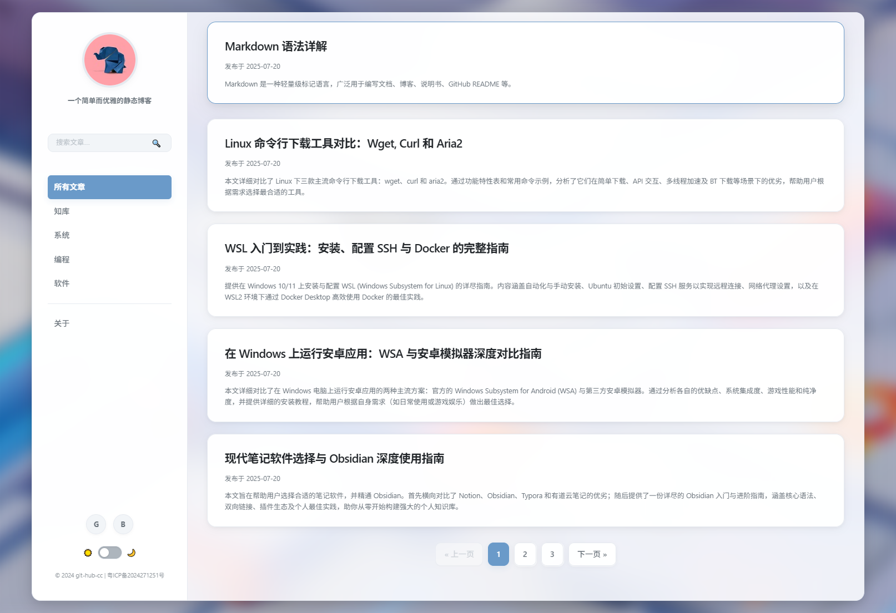

# 一个精致的单页静态博客 (An Exquisite Single-Page Static Blog)

这是一个基于纯 HTML、CSS 和 JavaScript 构建的现代化、响应式的单页应用 (SPA) 静态博客。它无需后端服务或数据库，所有内容均由 Markdown 文件驱动，可轻松部署在任何静态网站托管平台（如 GitHub Pages、Vercel 等）。

该项目的设计灵感源自 Apple 的美学，采用了流畅的“液态玻璃”（Frosted Glass）效果，并内置了完善的深色/浅色模式切换功能，旨在提供极致的阅读体验。

[English Version](./README.md)

## ✨ 主要特性

- **单页应用 (SPA) 架构**: 使用 URL Hash 实现前端路由，页面切换平滑无刷新，并带有淡入淡出动画。
- **响应式与移动端优先**: 完美适配桌面、平板和手机设备。在移动端，侧边栏会自动转换为一个紧凑的汉堡导航菜单。
- **深色/浅色模式**:
    - 自动检测并匹配操作系统的色彩偏好。
    - 提供手动切换按钮，并将用户的选择保存在本地。
- **Markdown 驱动**: 所有文章和“关于”页面均使用 Markdown 编写，易于创作和维护。
- **动态内容加载**: 博客文章索引和 Markdown 内容通过 `fetch` API 异步加载，性能高效。
- **客户端全文搜索**: 无需后端支持，在前端即可快速搜索所有文章的标题和摘要。
- **文章分类与分页**: 支持按分类筛选文章，并在文章列表过长时自动生成分页导航。
- **代码语法高亮**: 集成 `highlight.js`，自动美化文章中的代码块，并支持多种主题。
- **一键复制代码**: 在每个代码块右上角悬停时，会自动显示“复制”按钮，方便读者。
- **打印友好**: 提供了专门的打印样式，在打印时会自动移除导航、按钮等无关元素，优化文章排版，节省纸张。
- **SEO 优化**: 在 `index.html` 中预置了基础的 `meta` 标签，有助于搜索引擎优化。
- **现代设计美学**: 采用优雅的字体、间距和阴影系统，结合“液态玻璃”背景，视觉效果出众。

## 📸 预览

|        亮色模式 (Light Mode)        |       深色模式 (Dark Mode)        |
|:-------------------------------:|:-----------------------------:|
|  |  |

## 🛠️ 技术栈

- **前端**: `HTML5`, `CSS3` (Flexbox, CSS Variables), `JavaScript (ES6+)`
- **核心库**:
    - `marked.js`: 用于将 Markdown 实时解析为 HTML。
    - `highlight.js`: 用于实现代码块的语法高亮。
- **架构**: 单页应用 (SPA), 纯静态 (Static Site)

## 🚀 如何使用

### 1. 克隆或下载项目

```bash
git clone https://github.com/git-hub-cc/Blog.git
cd Blog
```

### 2. 本地预览

由于项目使用了 `fetch` API 来加载本地文件，**不能**直接通过 `file://` 协议在浏览器中打开 `index.html`。你需要一个本地的 Web 服务器来预览。

推荐使用以下任一简单方法：

- **使用 VS Code 的 Live Server 插件**: 右键点击 `index.html`，选择 "Open with Live Server"。
- **使用 Node.js 的 `serve` 包**:
  ```bash
  # 如果没有安装 serve，先全局安装
  npm install -g serve
  # 在项目根目录运行
  serve
  ```
- **使用 Python 内置的 HTTP 服务器**:
  ```bash
  # Python 3.x
  python -m http.server
  # Python 2.x
  python -m SimpleHTTPServer
  ```
然后访问浏览器中显示的地址（如 `http://localhost:3000`）。

### 3. 自定义你的博客

#### a. 修改站点信息
打开 `index.html`，你可以修改以下内容：
- **网站标题**: `<title>Blog</title>`
- **SEO 信息**: `<meta name="description" ...>` 和 `<meta name="keywords" ...>`
- **头像**: 修改 `` 的 `src` 属性。
- **站点描述**: 修改 `<h2 class="site-description">...</h2>`。
- **导航分类**: 修改 `<nav class="site-nav">` 中的 `<li>` 元素。
    - `href` 属性定义了分类的路由，例如 `#/category/programming`。
    - `data-nav-id` 用于高亮当前活动的导航项，应与分类名保持一致。
- **社交链接**: 修改 `<div class="social-links">` 中的 `<a>` 标签。
- **版权信息**: 修改 `<div class="copyright">...</div>`。

#### b. 添加或修改文章
这是核心步骤，分为两步：

**第一步：创建 Markdown 文件**
在 `blog/md/` 目录下创建或修改 `.md` 文件。文件名建议使用有意义的英文（例如 `my-first-post.md`）。

**第二步：更新文章索引**
打开 `blog/posts.json` 文件，它是一个 JSON 数组，每个对象代表一篇文章。按照以下格式添加一个新的文章对象到数组的**最前面**（以实现按时间倒序排列）：

```json
{
  "file": "your-post-filename.md",
  "title": "你的文章标题",
  "date": "2024-08-15",
  "category": "programming",
  "summary": "这里是文章的简短摘要，会显示在文章列表页。支持纯文本。"
}
```

**注意**: `category` 的值应该与你在 `index.html` 导航菜单中设置的分类ID（`data-nav-id`）和路由（`#/category/{category}`）相匹配。

#### c. 修改样式和主题
- **颜色、字体、间距**: `blog/css/style.css` 文件大量使用了 CSS 变量。你可以在文件顶部的 `:root` 和 `[data-scheme="dark"]`选择器中轻松修改全局样式。
- **代码高亮主题**: 如果不喜欢默认的 `atom-one-dark` 主题，可以从 `highlight.js`官网下载其他主题的 CSS 文件，替换 `blog/lib/` 中的 `atom-one-dark.min.css`，并在 `index.html` 中更新链接。

### 4. 部署
完成所有修改后，只需将整个项目文件夹上传到任何支持静态文件托管的服务器即可。例如：
- **GitHub Pages**: 将项目推送到 GitHub 仓库，并在仓库设置中开启 GitHub Pages 功能。
- **Vercel / Netlify**: 将项目与你的 Git 仓库关联，它们会自动完成构建和部署。
