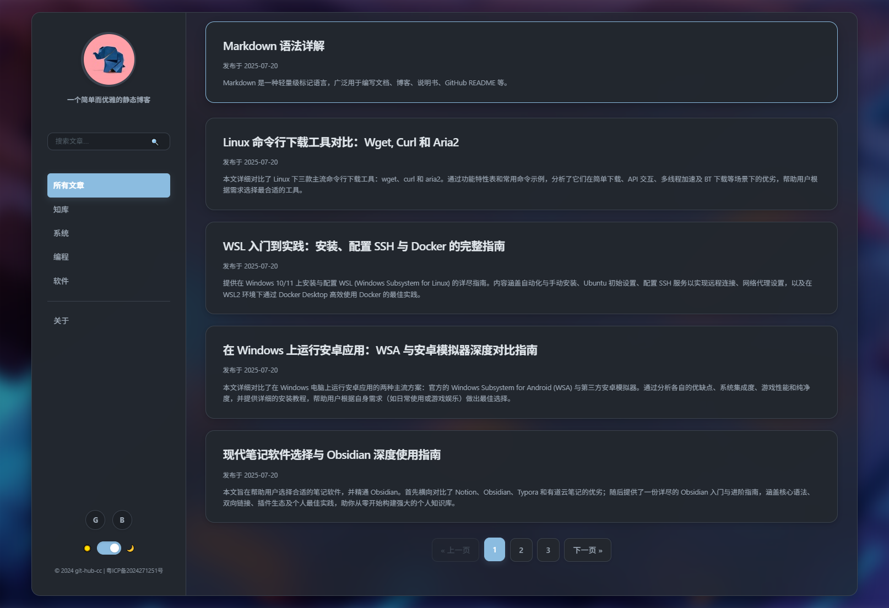

# An Exquisite Single-Page Static Blog

This is a modern, responsive, single-page application (SPA) static blog built with pure HTML, CSS, and JavaScript. It requires no backend service or database. All content is driven by Markdown files, making it easy to deploy on any static site hosting platform (like GitHub Pages, Vercel, etc.).

The project's design is inspired by Apple's aesthetics, featuring a smooth "Frosted Glass" effect and a fully integrated dark/light mode toggle, aiming to provide the ultimate reading experience.

[中文版](./README-cn.md)

## ✨ Key Features

- **Single-Page Application (SPA) Architecture**: Utilizes URL Hash for front-end routing, enabling smooth, refresh-free page transitions with fade-in/fade-out animations.
- **Responsive & Mobile-First**: Perfectly adapted for desktop, tablet, and mobile devices. On mobile, the sidebar automatically collapses into a compact hamburger menu.
- **Dark/Light Mode**:
    - Automatically detects and matches the operating system's color preference.
    - Provides a manual toggle switch and saves the user's choice locally.
- **Markdown-Driven**: All posts and the "About" page are written in Markdown, making content creation and maintenance easy.
- **Dynamic Content Loading**: The blog post index and Markdown content are loaded asynchronously via the `fetch` API for high performance.
- **Client-Side Full-Text Search**: Instantly search through all post titles and summaries on the front-end, with no backend required.
- **Post Categorization & Pagination**: Supports filtering posts by category and automatically generates pagination when the post list is long.
- **Code Syntax Highlighting**: Integrates `highlight.js` to automatically beautify code blocks in posts, with support for multiple themes.
- **One-Click Code Copy**: A "Copy" button automatically appears on hover in the top-right corner of each code block for reader convenience.
- **Print-Friendly**: Provides dedicated print styles that automatically remove navigation, buttons, and other irrelevant elements, optimizing the post layout to save paper.
- **SEO Optimized**: Includes basic `meta` tags in `index.html` to help with search engine optimization.
- **Modern Design Aesthetics**: Employs an elegant system of typography, spacing, and shadows, combined with a "Frosted Glass" background for a stunning visual effect.

## 📸 Preview

| Light Mode | Dark Mode |
| :---: | :---: |
|  |  |

## 🛠️ Tech Stack

- **Frontend**: `HTML5`, `CSS3` (Flexbox, CSS Variables), `JavaScript (ES6+)`
- **Core Libraries**:
    - `marked.js`: For parsing Markdown into HTML in real-time.
    - `highlight.js`: For syntax highlighting of code blocks.
- **Architecture**: Single-Page Application (SPA), Static Site

## 🚀 How to Use

### 1. Clone or Download the Project

```bash
git clone https://github.com/git-hub-cc/Blog.git
cd Blog
```

### 2. Preview Locally

Because the project uses the `fetch` API to load local files, you **cannot** simply open `index.html` in your browser via the `file://` protocol. You need a local web server to preview it.

Here are a few recommended simple methods:

- **Using VS Code's Live Server extension**: Right-click `index.html` and select "Open with Live Server".
- **Using Node.js's `serve` package**:
  ```bash
  # If you don't have serve, install it globally first
  npm install -g serve
  # Run in the project root directory
  serve
  ```
- **Using Python's built-in HTTP server**:
  ```bash
  # Python 3.x
  python -m http.server
  # Python 2.x
  python -m SimpleHTTPServer
  ```
Then, visit the address displayed in your browser (e.g., `http://localhost:3000`).

### 3. Customize Your Blog

#### a. Modify Site Information
Open `index.html` and you can change the following:
- **Site Title**: `<title>Blog</title>`
- **SEO Information**: `<meta name="description" ...>` and `<meta name="keywords" ...>`
- **Avatar**: Modify the `src` attribute of ``.
- **Site Description**: Modify `<h2 class="site-description">...</h2>`.
- **Navigation Categories**: Modify the `<li>` elements within `<nav class="site-nav">`.
    - The `href` attribute defines the category route, e.g., `#/category/programming`.
    - The `data-nav-id` is used to highlight the active navigation item and should match the category name.
- **Social Links**: Modify the `<a>` tags inside `<div class="social-links">`.
- **Copyright Information**: Modify `<div class="copyright">...</div>`.

#### b. Add or Modify Posts
This is the core step, divided into two parts:

**Step 1: Create a Markdown File**
Create or modify `.md` files in the `blog/md/` directory. It's recommended to use meaningful English filenames (e.g., `my-first-post.md`).

**Step 2: Update the Post Index**
Open the `blog/posts.json` file. It's a JSON array where each object represents a post. Add a new post object to the **beginning** of the array to maintain reverse chronological order:

```json
{
  "file": "your-post-filename.md",
  "title": "Your Post Title",
  "date": "2024-08-15",
  "category": "programming",
  "summary": "This is a brief summary of the post, which will be displayed on the post list page. Plain text is supported."
}
```

**Note**: The value of `category` should match the category ID (`data-nav-id`) and route (`#/category/{category}`) you set up in the `index.html` navigation menu.

#### c. Modify Styles and Themes
- **Colors, Fonts, Spacing**: The `blog/css/style.css` file makes extensive use of CSS Variables. You can easily modify global styles in the `:root` and `[data-scheme="dark"]` selectors at the top of the file.
- **Code Highlighting Theme**: If you don't like the default `atom-one-dark` theme, you can download other theme CSS files from the `highlight.js` website, replace `atom-one-dark.min.css` in `blog/lib/`, and update the link in `index.html`.

### 4. Deploy
After making all your changes, simply upload the entire project folder to any server that supports static file hosting. For example:
- **GitHub Pages**: Push your project to a GitHub repository and enable the GitHub Pages feature in the repository settings.
- **Vercel / Netlify**: Connect your Git repository to them, and they will automatically handle the build and deployment process.